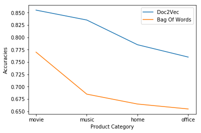

*Word Count: 993*

# Introduction

To represent words in a continuous word vector, @DBLP:journals/corr/abs-1301-3781 introduced  `word2vec` that embeds meaning in vector space.
As an extension to `word2vec`, @DBLP:journals/corr/LeM14 introduced paragraph vectors, or `doc2vec`, that represent word sequences. They demonstrated sentiment classification with the new model, where paragraph vectors performed better than bag-of-word features.
In this report, we aim to (1) recreate such results and strengthen the claim by using Permutation Test and (2) show the robustness of `doc2vec` by deployment test.

# Background

`word2vec` consists of two architectures: Continuous Bag-of-words (`cbow`) and Skip-grams. Both are feed-forward NNLMs that optimize for $\sum_t P(w_t | w_{t-k}, ..., w_{t+k})$ where $t$ is the current word, and $k$ the window of surroundings. They do so, however, with different methods: `cbow` predicts the current word given its surroundings, and Skip-gram the surrounding given the word. @DBLP:journals/corr/abs-1301-3781 claim that these models are effective in representing semantic meaning; for example, analogies are preserved: to gain the vector for the word `smallest` ($v_{smallest}$), you can simply compute $v_{biggest} - v_{big} + v_{small}$.

`doc2vec`, an extension for word sequences, also consist of two models: Distributive Memory (`dm`) and Distributive Bag-of-words (`dbow`). `dm` is analogous to `cbow`, where the paragraph vector acts as the shared memory for the current context. The paragraph vector is  included in the generative process of the current word, whereby back-propagation will yield a combinative vector for the sequence of words. `dbow` models are similar to Skip-gram; paragraph vectors are trained to predict the words given a small window. Order of words is lost in this model; therefore, it is named Distributed Bag Of Words.[@DBLP:journals/corr/LeM14; @DBLP:journals/corr/LauB16]

Paragraph vectors can then be used for classification tasks. We used ThunderSVM[@wenthundersvm18] for any classification task below, and  `gensim` for computation of `doc2vec`.[@rehurek_lrec]

\begin{table*}
\begin{center}
\begin{tabular}{@{}ccccccc@{}}
\toprule
\multirow{2}{*}{Epochs} & \multirow{2}{*}{Window Size} & \multicolumn{5}{c}{Architecture} \\ \cmidrule(l){3-7}
& & \texttt{dbow} & \texttt{dmm} & \texttt{dmc} & \texttt{dbow+dmm} & \texttt{dbow+dmc} \\ \midrule
\multirow{2}{*}{10} & 8 & 87.5\% & 83.0\% & 64.5\% & 89.5\% & 82.0\% \\
	& 12 & \textbf{88.0\%} (C) & 86.0\% & 60.0\% & 85.5\% & 81.5\% \\
	\multirow{2}{*}{20} & 8 & \textbf{87.5\%} (B) & 81.5\% & 71.0\% & 86.5\% & 81.5\% \\
	& 12 & \textbf{87.0\%} (A) & \textbf{85.0\%} (D) & \textbf{71.0\%} (E) & \textbf{85.0\%} (F) & \textbf{85.0\%} (G) \\
\bottomrule 
\end{tabular}
\end{center}
\caption{Accuracy results of each models for hyper-parameter selection} \label{table:hypacc}
\end{table*}

# Sentiment Classification

A classifier on paragraph vectors was trained on the Stanford IMDB Dataset to show the difference in accuracy between paragraph vectors and bag-of-words features, recreating results of @DBLP:journals/corr/LeM14. The dataset consists of 100,000 movie reviews with sentiments pre-classified by ratings.[@maas-EtAl:2011:ACL-HLT2011] 

## Methods

We trained `gensim` on all documents in the dataset, since a large corpus of documents is needed. After training, only 2,000 documents, balanced between the sentiments, was selected from the dataset for the SVM classifiers in the sections below. 

### Step 1: choosing hyper-parameter

Multiple models of paragraph vectors have been trained to select an optimal set of parameters. The parameters tested are: architecture, window size[^1], and number of epoch for training. Three models (`dbow`, `dm` with vector averaging (`dmm`), `dm` with concatenation (`dmc`)), and concatenation of these vectors were used for architecture. Minimum count for words and vector size were fixed at 3 and 100 respectively.

\paragraph*{Dataset} A set of 1,800 documents of 2,000 above was set for training, and the other 200 to test for parameters. In the steps following, the testing set of this experiment were discarded to prevent introducing bias to the test results.

[^1]: Note that in for the `gensim` library, window size needs to be halved for `dmc` models to adhere to the results on the paper.

### Step 2: `doc2vec` vs bag-of-words

SVM classifiers for the previously selected `doc2vec` model and the bag-of-words model were compared for accuracy. Stratified 10-fold cross-validation was performed on the 1,800 documents to avoid over-fitting and ensure consistent results.  Permutation test was performed on the concatenation of the test results.

## Evaluation 

### Step 1: Hyper Parameter Selection 

Table \ref{table:hypacc} shows the accuracies of classifiers trained with each models. Results are different from the original paper; (1) `dbow` performed as well as `dm` on all parameter sets, and (2) 7 out of 8 models of concatenation of vectors did not generate better result than any singular model. Moreover, `dmc` stands out performing worse than other architectures.

\begin{table}
\begin{center}
\begin{tabular}{@{}llll@{}}
\toprule
Models & p-value \\ \midrule
(A), (B) & 1.0 \\
(A), (C) & 0.827 \\
(A), (D) & 0.593 \\
(A), (E) & 0.0002 \\
(A), (F) & 0.533 \\
(A), (G) & 0.502 \\ \bottomrule
\end{tabular}
\end{center}
\caption{Permutation test results against model (A)} \label{table:hypp}
\end{table}

For verification, model (A) was selected as baseline, and six Monte Carlo Permutation Test at $R=5000$ was performed as shown on Table \ref{table:hypp}. 
Permutation Test results affirm poor results of `dmc` but no statistically significant difference otherwise at $\alpha = 0.05$. 

### Step 2: `doc2vec` vs bag-of-words

The concatenated model of `dbow` and `dmm` with window size 12 and epoch size 20 was selected to be tested against the bag-of-words model.

\begin{table}[h]
\begin{center}
\begin{tabular}{@{}ll@{}}
\toprule
Paragraph Vector & 87.4\% \\
Bag of Words & 78.8\% \\ \midrule
Difference & 9.1\% \\
p-value & 0.0002 \\ \bottomrule
\end{tabular}
\end{center}
\caption{Accuracies of Paragraph Vector and Bag of Words classifiers and their difference with p-values}\label{table:steptwo}
\end{table}

The Permutation Test with $\alpha = 0.05$ reported a statistically significant difference between the two classifiers, where the paragraph vector model performed ~4% better, alike the result of @DBLP:journals/corr/LeM14.

# Robustness Analysis 

We aim to find here how the two classifiers perform given different types of dataset to measure the robustness of the classifiers by the means of deployment test.

## Methods

\paragraph*{Dataset} A variety of review data was needed for this analysis. We used the dataset of Amazon reviews compiled by McAuley, which is categorized by product type and ratings. Since the ratings range from 0 to 5, ratings over 3.5 have been sorted as positive, and less than 2 as negative, to match the classification for the Stanford IMDB Dataset.[@DBLP:journals/corr/HeM16; @maas-EtAl:2011:ACL-HLT2011]

The classifiers are trained against all 2,000 documents from the experiment above, and tested against 200 of following product categories in the Amazon review: Movie, Instant Video, Digital Music, Clothings, Gardening, Home, Office, Sports. 

## Results

\begin{table}[h]
\begin{center}
\begin{tabular}{@{}lccl@{}}
\toprule
\multirow{2}{*}{Category} & \multicolumn{2}{c}{Accuracies} & \multirow{2}{*}{p-value} \\ \cmidrule(l){2-3}
& \texttt{doc2vec} & Bag of Words \\
\midrule
Movie & 85.5\% & 77.0\% & 0.0126 \\
Instant Video & 83.5\% & 76.0\% & 0.0512 \\
Music & 83.5\% & 68.5\% & 0.0008 \\
Home & 78.5\% & 66.5\% & 0.0030 \\
Office & 76.0\% & 65.5\% & 0.0150 \\
Clothings & 69.5\% & 69.0\% & 1.0000 \\
Gardening & 65.0\% & 64.0\% & 0.9004 \\
Sports & 65.0\% & 59.0\% & 0.2346 \\
\bottomrule
\end{tabular}
\end{center}
\caption{Accuracies of two classifiers with p-values, ranked by Accuracy}\label{table:raw}
\end{table}

Table \ref{table:raw} shows the accuracies and Monte Carlo Permutation Test results, ranked by the accuracy of `doc2vec` classifier. We see decrease in accuracy and increase in p-value as we change product categories to those that use a different set of vocabulary. It shows that both vectorization method are dependent on the set of vocabulary that they have have been train on. 

\ref{fig:plot} shows results that had Permutation Test results $p < 0.05$, since data with high p-value are likely have difference in result out of chance. We see that the rate at which `doc2vec` models decrease in accuracy is less than than that of Bag of Words. Therefore, we conclude that `doc2vec` is more robust with a newer dataset.

# Conclusion

We reimplemented sentiment analysis using `doc2vec`, and examined robustness of the classifiers by deployment test. These results prove that paragraph vectors are effective in replacing traditional bag-of-words models in representing documents as vectors. Further research should be conducted, however, to prove the claim of meaning representation in paragraph vectors.

# References

